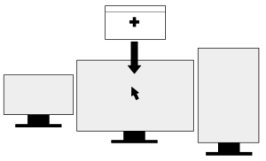

# Always Open on Active Screen

Extension for KDE’s window manager to make new windows always open on the monitor that has the mouse cursor.




## Installation

### Dependencies

`kwin` (tested with v5.22 - v5.23 on X11).

### Method 1: via graphical interface

1. Install the script via *System Settings* > *Window Management* > *KWin Scripts* > *Get New Scripts …* > search for *Always Open on Active Screen* > *Install*.
2. Activate the script by selecting the checkbox in the respective entry.

### Method 2: via command line

```bash
git clone https://github.com/nclarius/KWin-window-positioning-scripts.git
plasmapkg2 --type kwinscript -i KWin-window-positioning-scripts/always-open-on-active-screen
kwriteconfig5 --file kwinrc --group Plugins --key alwaysopenonactivescreenEnabled true
qdbus org.kde.KWin /KWin reconfigure
```


## Set-up

- In order for the script to work, you need to have *Active screen follows mouse* set to enabled:  
  - Via graphical interface:   
    *System Settings* > *Window Management* > *Window Behavior* > *Focus* > *Multiscreen Behavor* > *Active screen follows mouse* (the option shows only when multiple monitors are currently connected).  
  - Or by editing the config file:  
    `~/.config/kwinrc`: 
    ```
    [Windows]
    ActiveMouseScreen=true
    ```


## Small Print

© 2021 Natalie Clarius \<natalie_clarius@yahoo.de\>

with contributions by [Joe Defenderfer](https://github.com/joedefen).

This work is licensed under the GNU General Public License v3.0.  
This program comes with absolutely no warranty.  
This is free software, and you are welcome to redistribute and/or modify it under certain conditions.  

If you would like to thank me, you can always make me happy with a review or a cup of coffee:  
<a href="https://store.kde.org/p/1617640"></a>
<a href="https://www.paypal.com/donate/?hosted_button_id=7LUUJD83BWRM4"></a>&nbsp;&nbsp;<a href="https://www.buymeacoffee.com/nclarius"></a>
