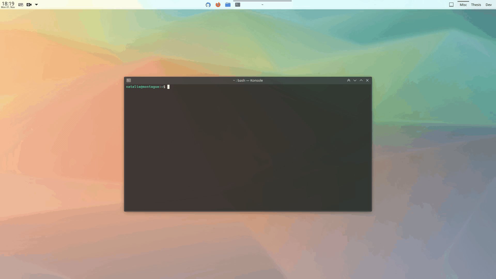
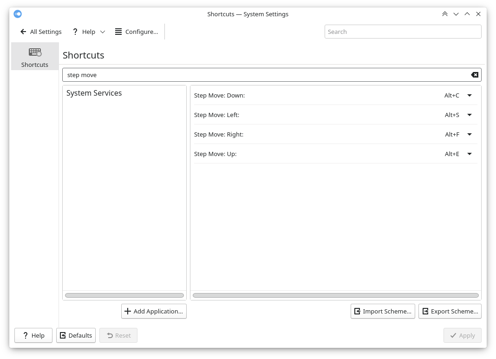

# Step Move

Extension for KDE’s window manager adding keyboard shortcuts to stepwise move (left/right/top/bottom/center) windows.

The step sizes and the keyboard shortcuts are configurable.







## Installation

### Dependencies

`kwin` (tested with v5.23 on X11).

### Method 1: via graphical interface

1. Install the script via *System Settings* > *Window Management* > *KWin Scripts* > *Get New Scripts …* > search for *Step Move* > *Install*.
2. Activate the script by selecting the checkbox in the respective entry.

### Method 2: via command line

```bash
git clone https://github.com/nclarius/KWin-window-positioning-scripts.git
plasmapkg2 --type kwinscript -i KWin-window-positioning-scripts/step-move
kwriteconfig5 --file kwinrc --group Plugins --key stepmoveEnabled true
qdbus org.kde.KWin /KWin reconfigure
```


## Configuration

To set the shortcuts to trigger the actions, go to *Settings* > *Shortcuts* > search for *Step Move* … > set your preferred shortcuts.

To configure the step sizes, go to *System Settings* > *Window Management* > *KWin Scripts* > configuration button in the *Step Move* entry.

You may have to disable the script, apply, reenable, and reapply in order for the changes to take effect.

If the configuration button is missing (this is due to a central limitation with the KWin script installation component), try the following:

```bash
mkdir -p ~/.local/share/kservices5
ln -sf ~/.local/share/kwin/scripts/stepmove/metadata.desktop ~/.local/share/kservices5/stepmove.desktop
```


## Usage

The default shortcuts are:

```
           top
          Alt+E
                
 left     center     right
Alt+S     Alt+D      Alt+F
    
          bottom
          Alt+C
```


## Small Print

© 2021 Natalie Clarius \<natalie_clarius@yahoo.de\>

This work is licensed under the GNU General Public License v3.0.  
This program comes with absolutely no warranty.  
This is free software, and you are welcome to redistribute and/or modify it under certain conditions. 

If you would like to thank me, you can always make me happy with a review or a cup of coffee:  
<a href="https://store.kde.org/p/1632259"></a>
<a href="https://www.paypal.com/donate/?hosted_button_id=7LUUJD83BWRM4"></a>&nbsp;&nbsp;<a href="https://www.buymeacoffee.com/nclarius"></a>

