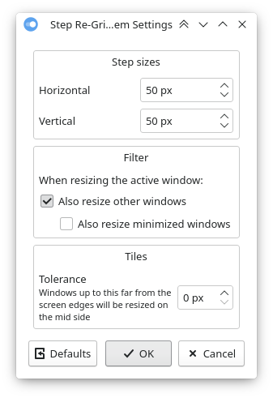
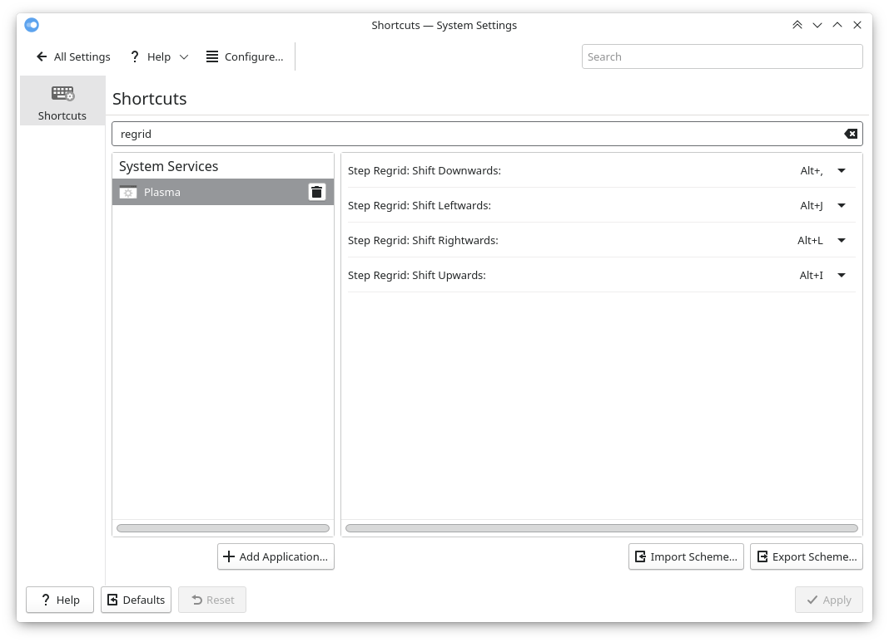

# Step Re-Grid

Extension for KDE’s window manager adding keyboard shortcuts to stepwise reshape the window grid, that is, resize the active or all windows from the center axes depending on their position:

- shift rightwards:
  - windows at the left screen edge: grow to right
  - windows at the right screen edge: shrink from left
  - windows in the middle: move right
- analogous for leftwards/upwards/downwards.

Whether to resize only the active window or all present windows, as well as the step sizes and the keyboard shortcuts are configurable.






[view in KDE Store](https://www.pling.com/p/1636998/)


## Installation

### Dependencies

`kwin` (tested with v5.23 on X11).

### Method 1: via graphical interface

1. Install the script via *System Settings* > *Window Management* > *KWin Scripts* > *Get New Scripts …* > search for *Step Re-Grid* > *Install*.
2. Activate the script by selecting the checkbox in the respective entry.

### Method 2: via command line

```bash
git clone https://github.com/nclarius/KWin-window-positioning-scripts.git
plasmapkg2 --type kwinscript -i KWin-window-positioning-scripts/step-regrid
kwriteconfig5 --file kwinrc --group Plugins --key stepgridEnabled true
qdbus org.kde.KWin /KWin reconfigure
```


## Configuration

To set the shortcuts to trigger the actions, go to *Settings* > *Shortcuts* > search for *Step Re-Grid* … > set your preferred shortcuts.

To configure the step sizes, go to *System Settings* > *Window Management* > *KWin Scripts* > configuration button in the *Step Re-Grid* entry.

You may have to disable the script, apply, reenable, and reapply in order for the changes to take effect.

If the configuration button is missing (this is due to a central limitation with the KWin script installation component), try the following:

```bash
mkdir -p ~/.local/share/kservices5
ln -sf ~/.local/share/kwin/scripts/stepregrid/metadata.desktop ~/.local/share/kservices5/stepregrid.desktop
```


## Usage

The default shortcuts are:

```
                    upwards    
                     Alt+I       
leftwards  Alt+J               Alt+L  rightwards
                     Alt+,
                   downwards
```


## Issues

If windows are being moved rather than resized, increase the tolerance in order to liberalize tiling detection.


## Small Print

© 2021 Natalie Clarius \<natalie_clarius@yahoo.de\>

This work is licensed under the GNU General Public License v3.0.  
This program comes with absolutely no warranty.  
This is free software, and you are welcome to redistribute and/or modify it under certain conditions.  

If you would like to thank me, you can always make me happy with [a review](https://store.kde.org/p/1632260) or [a cup of tea](https://www.buymeacoffee.com/nclarius).

