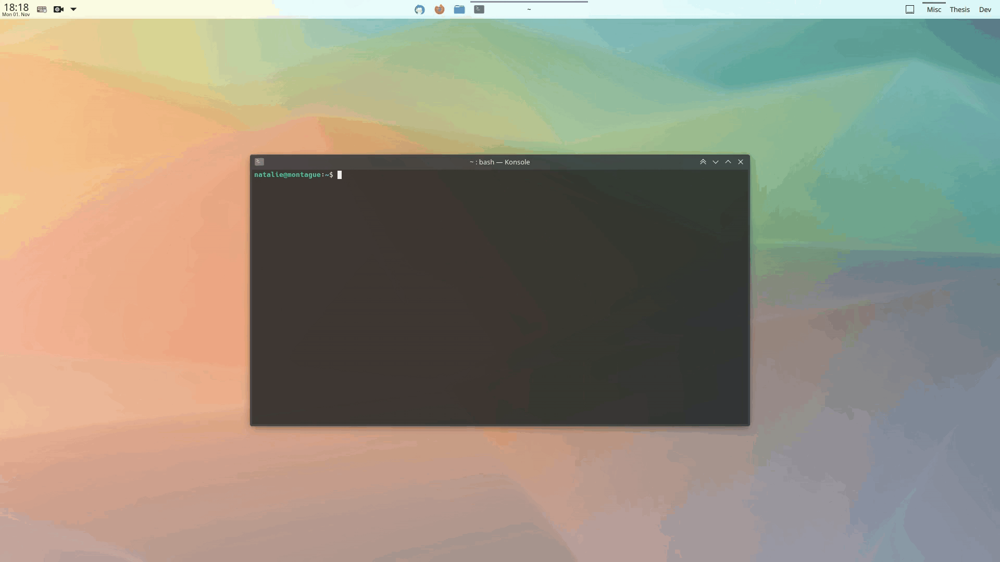
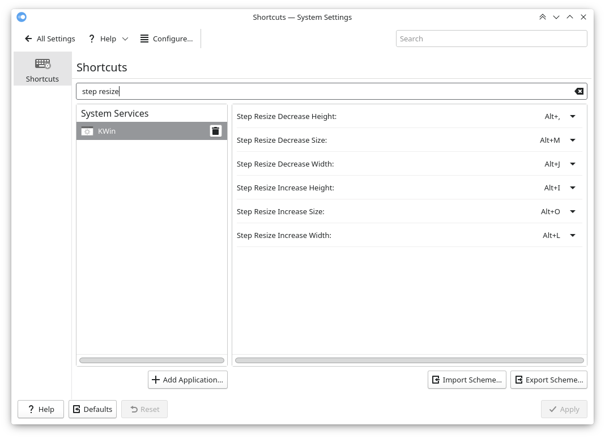

# Step Resize

Extension for KDE’s window manager adding keyboard shortcuts to stepwise resize (increase/decrease width/height) windows in consideration of their position:

- If the window is positioned in the middle of the screen, resize it on both sides evenly.
- If the window is tiled to a screen edge, resize it on the side facing the mid.

The advantage over the built-in resizing shortcut, which always resizes from the bottom right corner, is that tiled windows remain resizable and will stick to their screen edge; e.g. a window in the bottom right quarter of the screen will be enlarged and reduced from its top left corner, rather than being blocked by or being detached from the bottom and right screen edges.

The step sizes and the keyboard shortcuts are configurable.






[view in KDE Store](https://store.kde.org/p/1632260)


## Installation

### Dependencies

`kwin` (tested with v5.23 on X11).

### Method 1: via graphical interface

1. Install the script via *System Settings* > *Window Management* > *KWin Scripts* > *Get New Scripts …* > search for *Step Resize* > *Install*.
2. Activate the script by selecting the checkbox in the respective entry.

### Method 2: via command line

```bash
git clone https://github.com/nclarius/KWin-window-positioning-scripts.git
plasmapkg2 --type kwinscript -i KWin-window-positioning-scripts/step-resize
kwriteconfig5 --file kwinrc --group Plugins --key stepresizeEnabled true
qdbus org.kde.KWin /KWin reconfigure
```


## Configuration

To set the shortcuts to trigger the actions, go to *Settings* > *Shortcuts* > search for *Step Resize* … > set your preferred shortcuts.

To configure the step sizes, go to *System Settings* > *Window Management* > *KWin Scripts* > configuration button in the *Step Resize* entry.

You may have to disable the script, apply, reenable, and reapply in order for the changes to take effect.

If the configuration button is missing (this is due to a central limitation with the KWin script installation component), try the following:

```bash
mkdir -p ~/.local/share/kservices5
ln -sf ~/.local/share/kwin/scripts/stepresize/metadata.desktop ~/.local/share/kservices5/stepresize.desktop
```


## Usage

The default shortcuts are:

```
                       increase height    
                            Alt+I       increase size  
                                  Alt+O    
decrease width  Alt+J                   Alt+L  increase width     
                      Alt+M
        decrease size       Alt+,
                       decrease height
```


## Small Print

© 2021 Natalie Clarius \<natalie_clarius@yahoo.de\>

This work is licensed under the GNU General Public License v3.0.  
This program comes with absolutely no warranty.  
This is free software, and you are welcome to redistribute and/or modify it under certain conditions.  

If you would like to thank me, you can always make me happy with [a review](https://store.kde.org/p/1632260) or [a cup of tea](https://www.buymeacoffee.com/nclarius).

