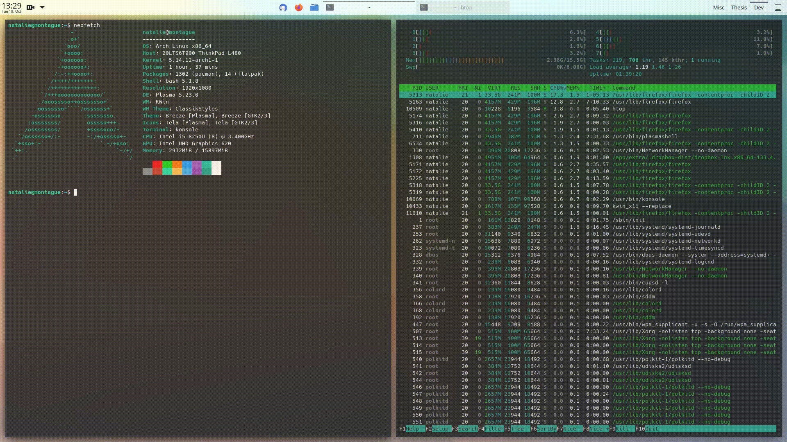

# Swap Left and Right

Extension for KDE’s window manager to add a keyboard shortcut to swap the windows tiled to the left and right halves of the screen.




[view in KDE Store](https://store.kde.org/p/1617645)


## Installation

### Dependencies

`kwin` (tested with v5.22 - v5.23 on X11).

### Method 1: via graphical interface

1. Install the script via *System Settings* > *Window Management* > *KWin Scripts* > *Get New Scripts …* > search for *Swap Left and Right* > *Install*.
2. Activate the script by selecting the checkbox in the respective entry.

### Method 2: via command line

```bash
git clone https://github.com/nclarius/KWin-window-positioning-scripts.git
plasmapkg2 --type kwinscript -i KWin-window-positioning-scripts/swap-left-right
kwriteconfig5 --file kwinrc --group Plugins --key swapleftrightEnabled true
qdbus org.kde.KWin /KWin reconfigure
```


## Configuration

To set the shortcut to trigger the action, go to *Settings* > *Shortcuts* > search for *Swap Left and Right* > set your preferred shortcut.


## Small Print

© 2021 Natalie Clarius \<natalie_clarius@yahoo.de\>

This work is licensed under the GNU General Public License v3.0.  
This program comes with absolutely no warranty.  
This is free software, and you are welcome to redistribute and/or modify it under certain conditions.  

If you would like to thank me, you can always make me happy with [a review](https://store.kde.org/p/1617645) or [a cup of tea](https://www.buymeacoffee.com/nclarius).

